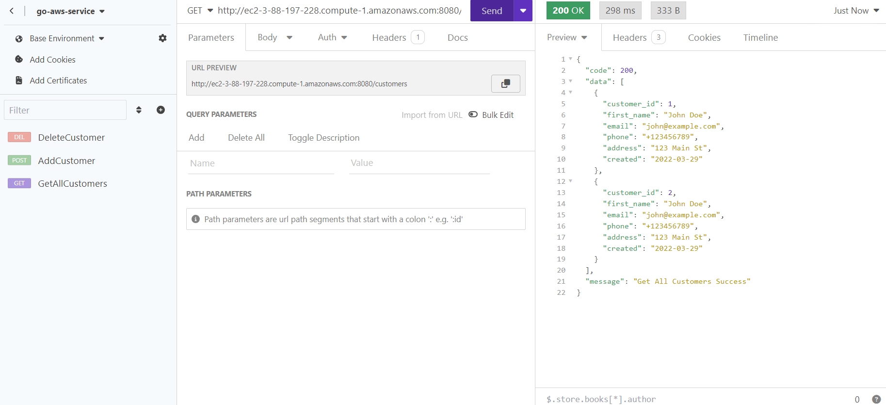
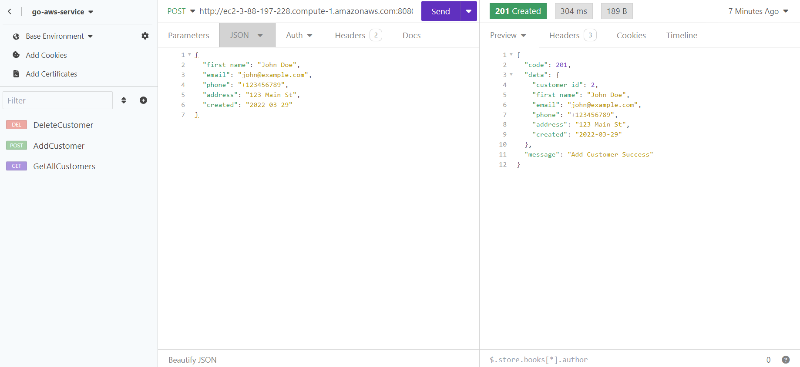
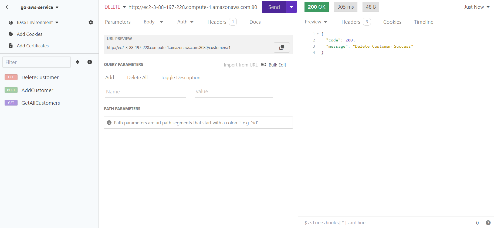
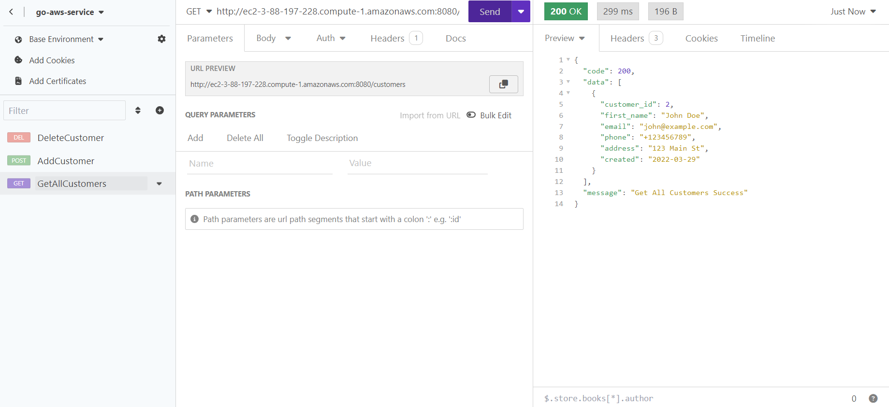

# go-aws-service

This repository contains my submission for the Distributed Cloud Computing Course.

## AWS EC2

1. Fill EC2 configuration as,

```
| Name            : go-service-aws
| OS              : Ubuntu Server 22.04 LTS (HVM), SSD Volume Type
| Architecture    : 64-bit (x86)
| Instance Type   : t2.micro
| Keypair Name    : go-aws-service-key
| Keypair Type    : RSA
| Keypair Format  : *.pem
| Network         : Default Settings with allow HTTPS traffic from the internet
| Storage         : 28 GiB
| Firewall        : New security group
```

2. Open terminal from your local machine where go-aws-service-key.pem is stored.
3. Run following command to configure and open Instance Terminal.

```bash
chmod 400 go-aws-service-key.pem
ssh -i go-aws-service-key.pem ubuntu@3.88.197.228
```

4. Update Instance package lists.

```bash
sudo apt-get update
```

5. Install Git and check Git version.

```bash
sudo apt-get install git
git version
```

6. Download go v1.21.1 from go.dev and open .tar.gz installation file.

```bash
wget https://go.dev/dl/go1.21.1.linux-amd64.tar.gz
sudo tar -C /usr/local -xzf go1.21.1.linux-amd64.tar.gz

```

7. Configure go to Environments Variable and save configuration.

```bash
export PATH=$PATH:/usr/local/go/bin
export GOPATH=$HOME/go
export PATH=$PATH:$GOPATH/bin
source ~/.bashrc
```

8. Check go version.

```bash
go version
```

## AWS RDS

1. Use standard creation.
2. Choose Engine Options as **MySQL community 8.0.35.**
3. Use free tier templates.
4. Choose DB Instance Identifier as **mycustomersdb.**
5. Set Database Master as,

```
| Master Username : admin
| Master Password : yourpassword
| Master Password : yourpassword
```

6. Set connectivity to connect EC2 Compute Resources with **go-aws-service.**
7. Keep all the configurations as default.
8. Create database and wait until status become **Available.**

## Web Service with AWS EC2 + AWS RDS

1. Create new folder from root with `$ mkdir web-service`

2. Change directory to web-service folder using `$ cd web-service`

3. Clone go-aws-service repository from Github using `$ git clone https://github.com/ricotandrio/go-aws-service`

4. Move to go-aws-service directory with `$ cd go-aws-service`

5. Create .env file using `$ touch .env`

6. Edit .env file using `$ nano .env` and set `MYSQL_HOST=admin:yourpassword@tcp(mycustomersdb.choaaquocl25.us-east-1.rds.amazonaws.com:3306)/mycustomersdb`

7. Install MySQL Client in AWS EC2 terminal.

```bash
sudo apt install mysql-client-core-8.0
```

8. Open AWS RDS Query Editor using AWS EC2 terminal via MySQL Client.

```bash
mysql -h mycustomersdb.choaaquocl25.us-east-1.rds.amazonaws.com -P 3306 -u admin -p
```

9. Create database mycustomersdb using `> CREATE DATABASE mycustomersdb;`

10. Run go service with `$ go run main.go` or `$ go run` at EC2 terminal.

11. Access endpoint at `http://ec2-3-88-197-228.compute-1.amazonaws.com:8080/`

## API Testing with Insomnia

### GET Endpoint `http://ec2-3-88-197-228.compute-1.amazonaws.com:8080/customers`



### POST Endpoint `http://ec2-3-88-197-228.compute-1.amazonaws.com:8080/customers`



### DELETE Endpoint `http://ec2-3-88-197-228.compute-1.amazonaws.com:8080/customers/1`



